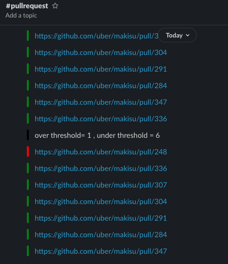

# Warning
Repo is a golang playground for myself to learn the language.

## Summary:

- ghpr = http request to github api repository getting pull requests list 
- slack = single function call that sends message preceded with a color flag .
- main = checks presence of environment variables and  starts iterating at each tick time (pollling period) 
- Dockerfile : minimize risks (just scratch base image and the built binary), no external library.
image size around 7MB and was pushed to docker hub under araji/ghpr .

## Usage :

An example of environment variables that needs to be set are located in the env file  , export them in current shell session and run 
$ go run .
after a polliPeriod minites ,  you should see slack notifications appear:

## running the binary
export the variables and run the binary 
$ ./ghpr 
2020/09/26 20:55:57 checking repo: github.com/uber/makisu
 
2020/09/26 20:55:58 over threshold 0 under threshold :=  0
2020/09/26 20:55:58 {"attachments":[{"color":"#000000","mrkdwn_in":["text","fields"],"text":"over threshold= 0 , under threshold = 0 "}]}
200

##  build the container
docker build -t ghpr:latest .
## run the container
docker run --env-file env ghpr:latest

##

## Notes:
without using oauth , the rate limit is very low .
